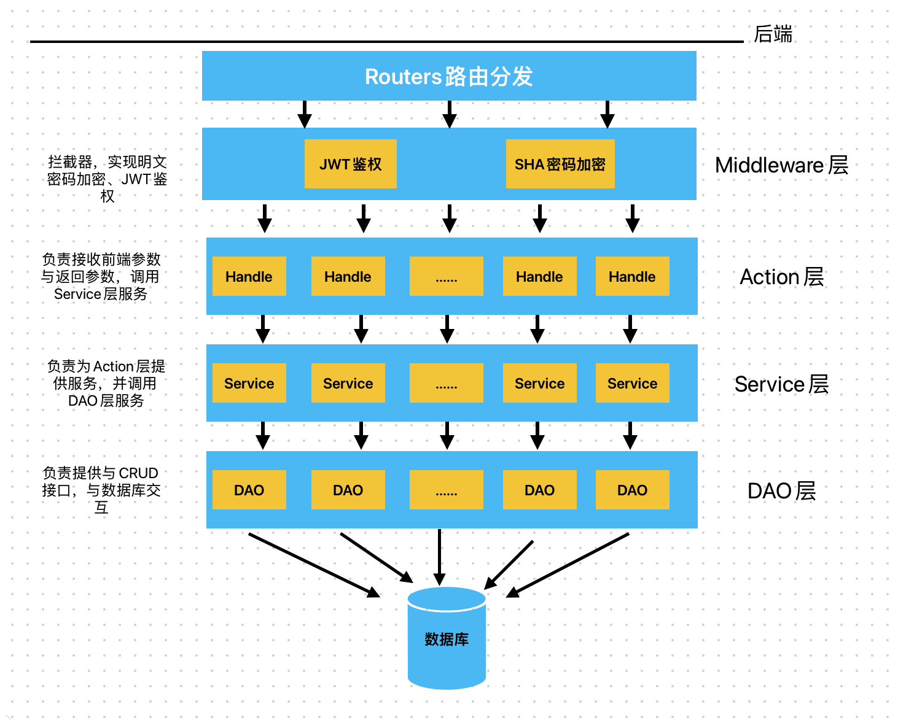

# douyin
字节跳动青训营项目极简版抖音  
开发中...

本地运行需要更改`./dao/init_db.go`文件中`Mysql`连接参数如`username`, `password`, 数据库名`Dbname`
，数据库需要自行建立，运行后程序自动建表。

| 接口名称   | url                             | 状态  |
| ---------- | ------------------------------- | ----- |
| 视频流接口 | /douyin/feed/                   | 未完成 |
| 用户注册   | /douyin/user/register/          | 完成  |
| 用户登录   | /douyin/user/login/             | 完成  |
| 用户信息   | /douyin/user/                   | 未完成 |
| 投稿接口   | /douyin/publish/action/         | 未完成 |
| 发布列表   | /douyin/publish/list/           | 未完成 |
| 赞操作     | /douyin/favorite/action/        | 未完成 |
| 喜欢列表   | /douyin/favorite/list/          | 未完成 |
| 评论操作   | /douyin/comment/action/         | 未完成 |
| 评论列表   | /douyin/comment/list/           | 未完成 |
| 关注操作   | /douyin/relation/action/        | 完成 |
| 关注列表   | /douyin/relation/follow/list/   | 未完成 |
| 粉丝列表   | /douyin/relation/follower/list/ | 未完成 |
| 好友列表   | /douyin/relation/friend/list/   | 未完成 |
| 发送消息   | /douyin/message/action/         | 未完成 |
| 聊天记录   | /douyin/message/chat/           | 未完成 |
|            |                                 |       |

